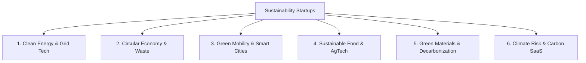

## The Expansion of the Green Economy

A decade ago, "sustainability startups" was a term primarily used to describe renewable energy companies (solar and wind) or niche consumer brands. Today, the green transition touches every industry, from concrete manufacturing and shipping to data center operations and software development. 

Because of this expansion, the umbrella terms "CleanTech" and "ClimateTech" can be confusing. For founders deciding what to build, and for investors evaluating deals, categorizing the space is essential.

Here is a comprehensive breakdown of the **6 core categories of sustainability startups** driving the market in 2026.

---

---

## 1. Clean Energy & Grid Technology
This category represents the foundation of the energy transition, focusing on generating, storing, and distributing electricity cleanly.
*   **Sub-niches:** Solar-as-a-Service, battery chemistry innovations, virtual power plants (VPPs), and smart grid software.
*   **Technical Challenge:** Intermittency. Because wind and solar generate power unpredictably, the grid requires smart software to balance supply and demand.
*   **Key Example:** *Enpal* (solar leasing) and *Tibber* (smart energy management).

## 2. Circular Economy & Waste Reduction
Startups in this category focus on eliminating waste and extending the life of physical products, turning one company's refuse into another's raw inputs.
*   **Sub-niches:** B2B electronic waste recycling, industrial product take-back logistics, sustainable packaging materials, and resale marketplaces.
*   **Technical Challenge:** Logistics and sorting. Disassembling products and matching recycled materials back into manufacturing pipelines requires complex tracking database systems.
*   **Key Example:** *Back Market* (refurbished tech marketplace) and *LanzaTech* (recycling carbon emissions into materials).

## 3. Green Mobility & Smart Cities
This category addresses the emissions of transport and urbanization, rebuilding transit networks around electric, micro, and shared mobility.
*   **Sub-niches:** EV charging infrastructure software, electric delivery fleet management, micromobility (e-bikes/scooters), and urban traffic flow optimization.
*   **Technical Challenge:** Infrastructure and grid load. Managing thousands of vehicles charging simultaneously without collapsing the local grid.
*   **Key Example:** *Bolt* (micromobility and ride-hailing) and *Easee* (EV charging hardware/software).

## 4. Sustainable Food & Agriculture (AgTech)
Agriculture is responsible for a massive portion of global emissions and water usage. Startups here focus on increasing food security while reducing environmental impacts.
*   **Sub-niches:** Precision farming software, vertical agriculture, plant-based or cultivated proteins, and food waste redirection platforms.
*   **Technical Challenge:** Scaling physical yields and biological safety while matching the economics of traditional farming.
*   **Key Example:** *Too Good To Go* (food waste marketplace) and *Infarm* (urban vertical farming).

## 5. Green Materials & Industrial Decarbonization
This represents the "hard-to-abate" sector. Startups in this category develop low-carbon alternatives to the foundational elements of modern society—cement, steel, plastics, and chemicals.
*   **Sub-niches:** Bio-based plastics, carbon-curing concrete, green hydrogen for steel production, and alternative textiles.
*   **Technical Challenge:** High capital expenditure and slow validation cycles. Inventing a new material requires years of lab validation and heavy scaling costs.
*   **Key Example:** *H2 Green Steel* (low-carbon steel manufacturing).

## 6. Climate Risk & Carbon SaaS
This is a software-first category. It builds the digital tools companies need to measure emissions, map supply chains, buy offsets, and predict physical climate risks.
*   **Sub-niches:** Carbon accounting, CSRD/VSME compliance portals, satellite-based physical risk forecasting, and ESG data aggregators.
*   **Technical Challenge:** Data quality. Collecting accurate, verifiable data from fragmented spreadsheets and suppliers without manual error.
*   **Key Example:** *Watershed* (enterprise carbon software) and *ExecutESG* (SME supply chain compliance portal).

---

## Strategic Takeaway for Builders

If you are planning to launch a startup:
*   **Categories 1, 3, and 5 (Energy, Mobility, Materials)** are **high capital intensity**. They require deep hardware research, physical infrastructure, and institutional funding.
*   **Categories 2, 4, and 6 (Circularity, AgTech, SaaS)** are highly suited for **software-first founders**. They rely on data orchestration, logistics optimization, and B2B workflows, allowing for rapid iterations and faster time-to-market.

If you are a software engineer, designer, or business expert looking to build in these categories, Pomegroup Studio is here to help. We co-build software startups, acting as your technical co-founder. We build your platform, manage compliance integrations, and help you scale.

**[Apply to Co-Build with Pomegroup](/co-build)** or read our [Sustainability Startup Ideas for 2026](/blog/sustainability-startup-ideas-2026) for inspiration.
