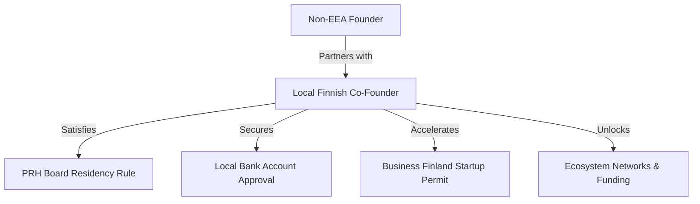

## The Finnish Dream Meets Corporate Governance

For international founders, Finland is increasingly viewed as the ultimate launchpad. Offering world-class technology infrastructure, access to a highly educated talent pool, robust public funding mechanisms through Business Finland, and a transparent regulatory environment, the country has earned its reputation as one of the most startup-friendly nations on earth. It is no surprise that founders from San Francisco to Singapore are eager to register a Finnish *Osakeyhtiö* (Oy) — a limited liability company — and build their companies from Helsinki.

However, as non-European Union (EU) or non-European Economic Area (EEA) founders embark on the incorporation process, they inevitably run into a major legal checkpoint: the **EEA Resident Board Member Rule**. 

Under Chapter 6, Section 10 of the Finnish Limited Liability Companies Act (*Osakeyhtiölaki*), a Finnish limited liability company must meet specific residency criteria for its governing board. Specifically, **at least one ordinary member of the board of directors must reside in the EEA**. 

If you are a founding team where all members are based outside the EEA, this rule can bring your startup ambitions to a sudden halt. In this comprehensive guide, we will break down the legal mechanics of this requirement, explain the cost and time implications of the exemption process, analyze the operational dangers of nominee director services, and show how a venture building partner like Pomegroup solves this rule out-of-the-box while adding strategic value.

---

## Decoding the Finnish Board Member Residency Requirement

To understand how to navigate this regulation, we must first look at the legal definitions and mechanics.

### 1. Who Counts as an EEA Resident?
The residency requirement is determined by a person's **permanent physical residence**, not their citizenship. An EU citizen living in the United States does not satisfy the residency requirement. Conversely, a US citizen with a permanent residency permit living and working in Finland, Germany, or Estonia does satisfy the requirement.

The European Economic Area (EEA) includes:
*   All 27 EU Member States
*   Iceland, Liechtenstein, and Norway

Countries like the United Kingdom, Switzerland, Canada, India, and the United States are **outside the EEA**. If you reside in any of these nations, you are considered a non-EEA resident for the purpose of Finnish corporate registration.

### 2. The Board Structure of a Finnish Oy
In Finland, a limited liability company is governed by a Board of Directors (*hallitus*). The law dictates the size and composition of the board:
*   **One or Two Ordinary Members:** If the board consists of only one or two ordinary members, there must be at least one deputy board member (*varajäsen*).
*   **Three or More Ordinary Members:** If the board has three or more ordinary members, a deputy member is optional.

The residency rule applies to the **ordinary members**. Specifically:
*   At least one ordinary board member must reside in the EEA.
*   The residency requirement also applies to the **Managing Director** (*toimitusjohtaja*), if the company elects to appoint one. If you appoint a Managing Director, they must reside in the EEA, unless the Patent and Registration Office (PRH) grants an exemption.

Let's illustrate the compliant vs. non-compliant board structures in the table below:

| Board Composition | EEA Residency Status | Compliant? | Notes |
| :--- | :--- | :--- | :--- |
| 1 Ordinary Member, 1 Deputy Member | Ordinary: USA   Deputy: USA | **No** | Neither ordinary nor deputy is an EEA resident. Requires PRH exemption. |
| 1 Ordinary Member, 1 Deputy Member | Ordinary: Finland   Deputy: India | **Yes** | The single ordinary member resides in the EEA. Compliant. |
| 3 Ordinary Members | Member 1: UK   Member 2: Canada   Member 3: Japan | **No** | None of the ordinary members reside in the EEA. Requires PRH exemption. |
| 3 Ordinary Members | Member 1: Germany   Member 2: USA   Member 3: Singapore | **Yes** | At least one ordinary member (Member 1 in Germany) resides in the EEA. Compliant. |

---

## Why Does This Rule Exist?

First-time founders often view the residency rule as an outdated bureaucratic hurdle, but it serves a vital purpose in Finnish corporate governance:
1.  **Administrative Reach:** The Finnish Tax Administration (*Verohallinto*), courts, and creditors must be able to serve official notices and legal summons to someone physically present within the European regulatory and legal framework.
2.  **Corporate Liability:** In cases of corporate malfeasance, tax evasion, or bankruptcy, having at least one board member subject to EEA jurisdictions ensures accountability. It prevents founders from setting up "ghost companies" that operate completely outside the reach of European enforcement agencies.
3.  **Local Representation:** It ensures that the company maintains some operational or representative presence near its legal home, enhancing the transparency and trust of the Finnish business ecosystem.

---

## The Exemption Permit Route: Costs, Timelines, and Friction

If your founding team does not have an EEA resident, your first legal option is to apply for a **residency exemption permit** from the Finnish Patent and Registration Office (PRH, *Patentti- ja rekisterihallitus*). 

While this sounds like a straightforward paperwork exercise, it introduces significant friction:

### 1. The Application Process
To apply for a residency permit, you must submit a formal application to the PRH. The application must justify why the company is being established in Finland, explain the nature of its business, and outline why a non-EEA resident is suitable to serve on the board. You must also supply official proof of residence and identity for the non-EEA applicants, often requiring apostilled or notarized translations of passports and utility bills.

### 2. Processing Fees
The PRH charges a non-refundable processing fee for residency exemptions. Typically, this fee ranges from **€120 to €150 per person** applying for the exemption. If you have multiple non-EEA board members requiring permits, the fees multiply.

### 3. Delays to Incorporation
This is the main drawback. The processing time for a PRH board member permit can take anywhere from **4 to 8 weeks**, depending on the caseload. During this time:
*   Your company cannot be registered in the Finnish Trade Register (*Kaupparekisteri*).
*   You do not have a Business ID (*Y-tunnus*), meaning you cannot sign commercial contracts, hire employees, or lease office space.
*   You cannot open a corporate bank account.

For a fast-moving startup, waiting two months just to register the company can kill momentum, delay product launches, and frustrate early investors.

### 4. Relational Constraints
A PRH residency exemption is not a blanket authorization for the company. It is tied to **specific individuals**. If your startup scales and you decide to appoint a new non-EEA board member, or if the board member who was granted the exemption leaves, you must apply for a new exemption permit. This introduces recurring administrative costs and delays throughout the life of your startup.

---

## The Nominee Director Trap: High Risk, Low Reward

To bypass the delays of the PRH exemption permit, many international founders turn to **nominee director services** (also known as local director or nominee board member services) offered by corporate service providers (CSPs).

Under this arrangement, the provider appoints a local Finnish resident to serve as the "ordinary board member" on paper. The founder and the nominee sign an internal agreement stating that the nominee has no actual ownership, no voting power, and no day-to-day operational control over the startup. The nominee acts solely as a legal placeholder to satisfy the PRH registry.

While this solves the residency rule on paper, it is a highly risky and expensive strategy in 2026:

### 1. Exorbitant Ongoing Costs
Nominee director services are not cheap. Corporate service providers typically charge between **€2,500 and €6,000+ per year** for a nominee board member. For an early-stage startup, this is a significant amount of capital spent on administrative overhead. This money provides zero operational value, zero lines of code, and zero customer acquisitions.

### 2. The Banking Hurdles
Finnish banks (such as Nordea, OP Financial Group, and Danske Bank) are bound by strict European Anti-Money Laundering (AML) and Know Your Customer (KYC) regulations. When you apply for a corporate bank account, banks conduct deep background checks. 

If the bank discovers that your local board member is a professional nominee who is listed on the boards of 20 other companies, they will immediately flag your application. During the KYC interview, the bank will ask the local board member detailed questions about the startup's operations, business model, and transactions. If the nominee board member cannot answer these questions because they have no operational involvement, the bank will **deny your account application**. Getting a corporate bank account in Finland is already a challenging process for foreigners; using a nominee director makes it almost impossible.

### 3. Regulatory and Legal Vulnerabilities
From a legal standpoint, a board member of a Finnish Oy carries fiduciary duties and personal liability for tax compliance and legal adherence. If the startup accidentally violates a local regulation, the nominee director is legally on the hook. 

Because of this liability, nominee directors will often insist on veto rights over company decisions, or demand that the company purchase expensive Directors and Officers (D&O) liability insurance. If a disagreement arises, the nominee can resign abruptly, throwing your company into non-compliance and halting your business operations.

---

## The Strategic Solution: Partnering with a Resident Co-Founder

Instead of treating the board residency rule as an administrative tax, smart founders turn it into a competitive advantage by bringing on a **local, resident co-founder**.

A genuine resident co-founder solves the regulatory requirement naturally while adding immense value to the venture:

### Why Aligned Partnership Beats Administrative Placeholders:
1.  **Ecosystem Credibility:** A local co-founder brings immediate trust. When dealing with the PRH, the Tax Administration, and local banks, having a resident who speaks the language and understands the business culture speeds up approvals.
2.  **Aligned Incentives:** Unlike a nominee director who charges a flat fee regardless of whether your business succeeds or fails, a co-founder is motivated by equity. They are committed to building a successful company.
3.  **Local Network Access:** Finland has a tight-knit startup ecosystem. A local partner provides warm introductions to Finnish venture capital firms (such as Lifeline Ventures, Maki.vc, and Icebreaker.vc), local angel networks (FiBAN), and key university talent pools (Aalto University).
4.  **Operational Support:** Building a company in a new market involves local regulations, local employment laws, and local accounting standards. Having an active partner on the ground ensures these details are handled correctly.

---

## Pomegroup: Your Resident Co-Building & Infrastructure Partner

At Pomegroup, we built our venture studio model specifically to solve these legal and operational challenges for international founders. We don't believe in passive nominee services or transactional development agencies. Instead, we act as a **true co-building partner**.

When you apply and are accepted into the Pomegroup Co-Build Program, we provide the full stack of technical, administrative, and strategic infrastructure needed to launch in Finland.

### How Pomegroup Solves the EEA Residency Rule:
*   **Active Board Representation:** As part of our co-building agreement, a senior member of the Pomegroup team (such as our founder, Mahdi Farimani) serves as an ordinary board member of your Finnish Oy. Because we are residents in Finland, your company complies with the PRH residency requirement from day one, without needing exemption permits or facing nominee-related bank flags.
*   **Active Technical Execution:** We are not paper-only directors. Our studio provides CTO-level leadership, full-stack software development, UI/UX design, and product management. We build, launch, and scale your product alongside you.
*   **Smooth Banking and Setup:** We help you navigate the setup process, preparing all necessary KYC documentation and introducing your venture to our partner banks to ensure a smooth bank account opening process.
*   **Ecosystem Integration:** We help you prepare applications for non-dilutive R&D funding from Business Finland (such as the Tempo grant or Young Innovative Companies program) and introduce you to local VC networks.

By aligning our incentives through an equity-sharing model (ranging from 20% to 50% depending on the build scope and capital contribution), we ensure that your local board member is deeply committed to your startup's long-term success.

---

## Step-by-Step Guide to Setting Up a Finnish Oy as a Non-EEA Founder

If you are planning to incorporate in Finland, here is the roadmap you should follow:

### Step 1: Secure Your Resident Board Member
Do not apply for company registration until you have secured an EEA resident board member. If you do not have one, apply to the Pomegroup Co-Build Program or search for a local co-founder.

### Step 2: Draft the Shareholders' Agreement
Establish clear rules regarding equity splits, vesting schedules, roles, and decision-making. Ensure all intellectual property (IP) is assigned to the company.

### Step 3: Establish a Local Address
Your company must have a registered office address in Finland. Many virtual office providers offer virtual address services, but working with a local partner like Pomegroup gives you access to a physical office space and address.

### Step 4: Register with the PRH (Trade Register)
Submit your incorporation documents to the PRH. If you have a resident board member, this process is completed online through the YTJ system (Business Information System) and is typically processed in a few business days.

### Step 5: Open a Corporate Bank Account
Prepare your business plan, pitch deck, and board details. Schedule a KYC meeting with a Finnish bank or set up an account with a modern business banking provider that supports Finnish Oys.

### Step 6: Register for Taxes
Submit registrations to the Finnish Tax Administration for the VAT Register (*ALV-rekisteri*), the Prepayment Register (*Ennakkoperintärekisteri*), and the Employer Register (*Työnantajarekisteri*), depending on your hiring plans.

---

## Conclusion: Build on Solid Foundations

Finland's EEA Resident Board Member rule is not designed to exclude international talent; it is a regulatory safeguard to maintain the high standards of the Finnish corporate landscape. Trying to bypass it with temporary exemptions or expensive nominee services creates administrative friction and exposes your startup to banking failures.

By partnering with a local, active co-builder like Pomegroup, you solve the residency requirement naturally. You also gain a dedicated team of engineers, designers, and startup strategists who are aligned with your success and ready to turn your product vision into a scalable reality.

If you are ready to build in Finland with a partner who handles both the code and the local infrastructure, let's connect.
